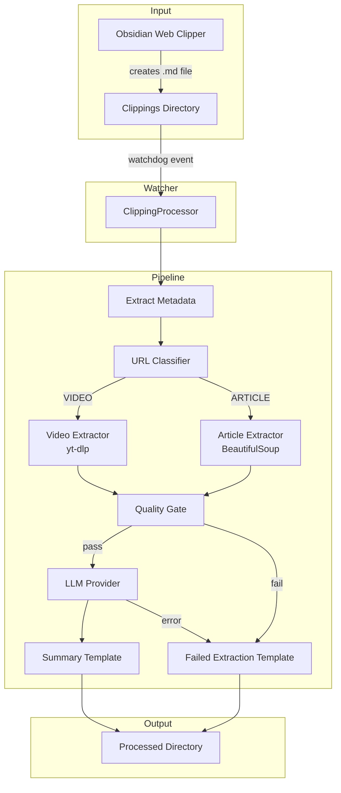
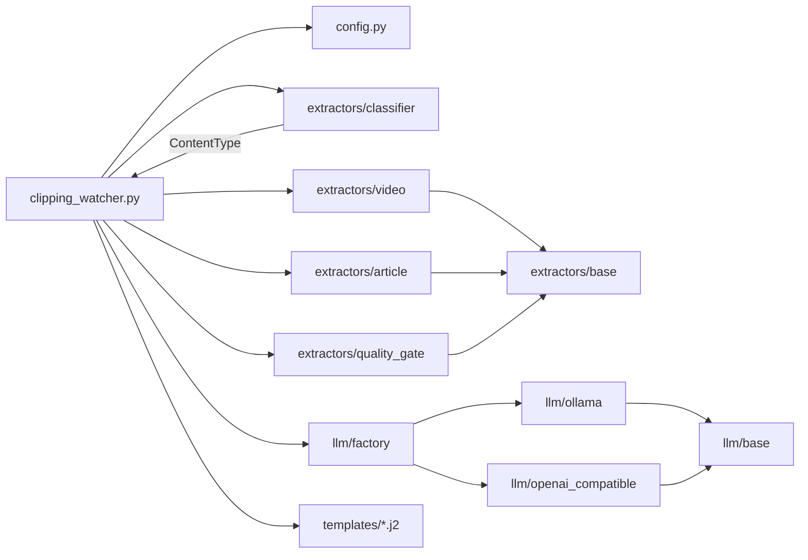
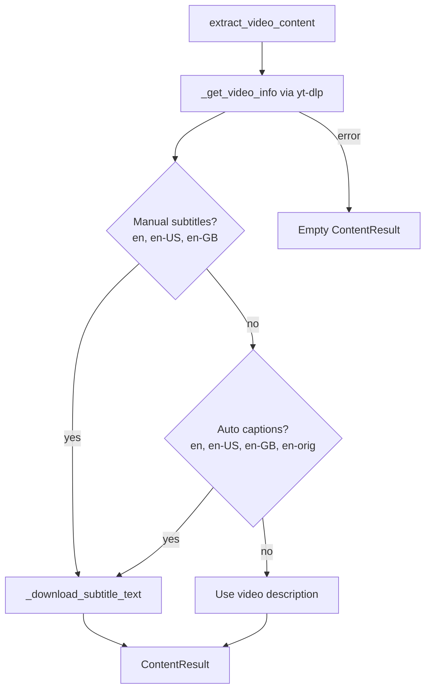
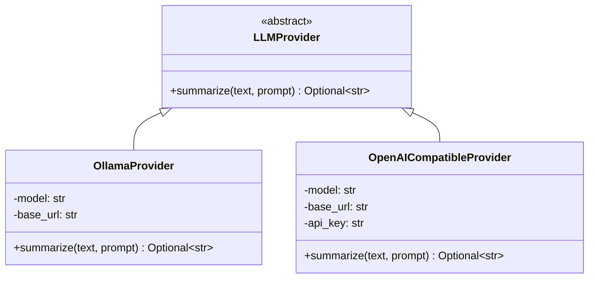

# Architecture

## System Overview



## Module Dependency Graph



## Data Flow

### ContentResult

The `ContentResult` dataclass is the standard exchange format between extractors and the pipeline:

```python
@dataclass
class ContentResult:
    title: str = ""
    text: str = ""              # Main extracted content
    author: Optional[str] = None
    url: str = ""
    content_type: str = ""      # "video" or "article"
    extraction_succeeded: bool = False
    metadata: dict = {}         # Extra data (duration, description, etc.)
```

### Video Extraction Fallback Chain



### Configuration Merge

User config is deep-merged with defaults — partial configs only override specified keys:

```
DEFAULT_CONFIG          config.yaml              Merged Result
{                       {                        {
  llm: {                  llm: {                   llm: {
    provider: ollama        model: llama3.1:8b       provider: ollama    ← default
    model: llama3.2:3b    }                          model: llama3.1:8b  ← override
    base_url: ...         }                          base_url: ...       ← default
  }                                                }
}                                                }
```

## LLM Provider Interface



New providers implement `LLMProvider.summarize()` and register in `llm/factory.py`.

## Template System

Two Jinja2 templates share common sections but differ in their primary content:

| Section | summary.md.j2 | failed_extraction.md.j2 |
|---------|---------------|-------------------------|
| Frontmatter | tags: processed | tags: needs-review |
| Primary content | AI Summary (LLM response) | Failure notice + original excerpt |
| My Notes | Prompts for manual annotation | Same |
| Dataview query | Linked projects lookup | Same |

## Error Handling Strategy

All components follow **graceful degradation**:

1. **Extractors** — return empty `ContentResult` on failure (never raise)
2. **Quality gate** — catches empty/garbage extractions before LLM
3. **LLM providers** — return `None` on failure (never raise)
4. **Pipeline** — falls back to failed extraction template if LLM fails
5. **Watcher** — catches all exceptions in `process_clipping`, logs, and continues watching
